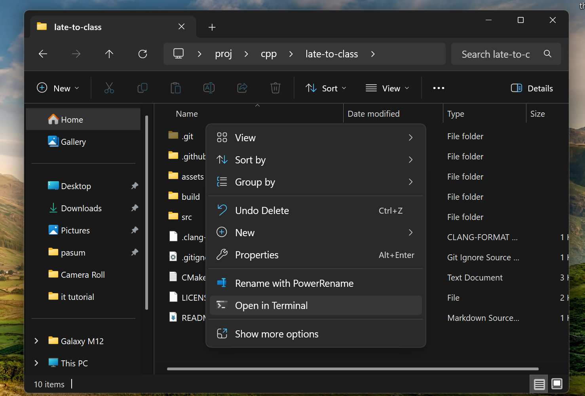

# Requirements (Windows)
Run this in Command Prompt or Windows Powershell to get the tools needed to compile
```bash
winget install WinLibs cmake Git.Git ezwinports.make
```
*Note: you may need to restart your Command Prompt before proceding*

# Compilation steps
1. Download and extract this project
2. Open Command Prompt in this folder (Follow image)
   
4. Run cmake to prepare the compilation using this command (You are only required to run this later on if you've changed the file structure)
  ```bash
  cmake -G "MinGW Makefiles" -S . -B build
  ```
4. Compile and run the files
  ```bash
  make -C build run -j $(nproc)
  ```
# Info
1. The c++ files are in src folder
2. You can use any text editor to edit the c++ files
