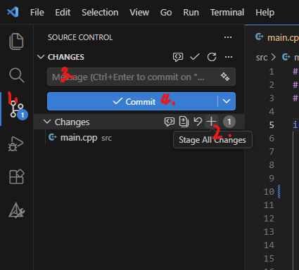
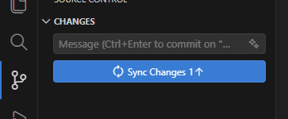

## How to Run and Set Up This Project

1. **Download the Bootstrap Utility:** Acquire the automated [Setup Script](https://github.com/lhldev/late-to-class/releases/download/setup-script/SetupProject.bat) to your local machine.
2. **Execute the Configuration:** Run the downloaded `.bat` file. For detailed execution guidelines, please review the [Setup Script Release Notes](https://github.com/lhldev/late-to-class/releases/tag/setup-script).
3. **Initialize the Workspace:** Once the script completes the repository cloning process, open the newly generated folder within Visual Studio Code.
4. **Compile and Execute:** Press **Ctrl + Shift + B** to initiate the build task sequence and run the compiled C++ project.

## How to sync your edit with this Project

1. Click the Git tab
2. Press the '+' icon to stage your files
3. Enter a commit message inside the box
4. Press the commit button
5. Press sync button to push your changes
